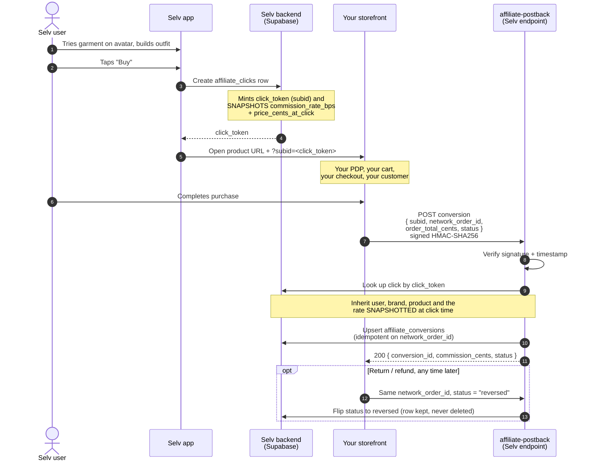

# Selv — Affiliate & Brand Partnership System

**Two documents in one.** Part 1 is written to be sent to a prospective brand
partner. Part 2 is the internal design record for the engineering that backs
it up. Part 3 is an honest list of what is not built.

Last updated: 2026-07-26.

---

# Part 1 — For brands

## 1.1 What Selv is

Selv is a virtual wardrobe and try-on app. Users build a character (no photo
upload, no body scan, no biometric data), upload or browse clothes, and see
them on that character before deciding to buy.

The commercial consequence of that is simple: by the time a Selv user taps
**Buy**, they have already seen the garment on a body, in an outfit, next to
things they already own. That is not a banner impression. It is the highest
purchase intent that exists short of a fitting room.

## 1.2 The commercial model, in plain language

1. You list your products in Selv (a product feed — see §1.4).
2. Selv users try those products on their avatar and build outfits with them.
3. When a user taps **Buy**, we send them to *your* product page, on *your*
   site, with a tracking identifier attached. You own the checkout, the
   customer, the payment, and the data. Selv never touches the transaction.
4. When the order completes, your system (or your affiliate network) tells us.
5. You pay Selv a percentage of the attributed order value.

**Default rate: 10% of order value.** Negotiable per brand — it is a single
number on your brand record and we will happily talk about it. Per-product
overrides are supported too, so you can pay less on already-discounted stock
or more on items you want pushed, without renegotiating the whole agreement.

There is no listing fee, no CPM, no CPC and no minimum spend. If Selv does not
drive a sale, Selv does not get paid. Your downside is bounded at zero.

## 1.3 How attribution actually works



The `subid` is the whole mechanism. It is a random opaque token, unique per
tap. Echo it back to us and the sale is attributed; lose it and we record the
sale as unattributed (still billable, but we lose the user-level funnel data).

## 1.4 Two ways to integrate

### Option A — via an affiliate network you are already on

**Effort on your side: essentially none.**

If you already run an affiliate programme through **Rakuten Advertising, CJ
Affiliate, Impact, ShopStyle Collective, or Awin**, Selv applies as a
publisher in your programme like any other. You approve us, we take your
existing product feed and tracking links from the network, and conversions
flow through the network's standard postback. You do not write any code, you
do not build a feed, and Selv is billed and paid through the same monthly
process as every other publisher you already work with.

**Be aware that this is the realistic path for almost every brand.** If you
are large enough to have an affiliate manager, the answer to "will you build a
custom integration for a new app" is correctly *no*, and we are not going to
ask. Option A exists so the answer can be yes on day one, at the cost of a
percentage point of network fee and slightly coarser data.

### Option B — direct integration

**Effort on your side: a few hours of backend work.**

Better economics (no network fee) and better data. Appropriate for DTC brands
and smaller labels without an existing affiliate programme, or for a partner
who wants the try-on analytics Option A cannot carry.

Two pieces:

1. **Product feed** — POST your catalog to Selv's ingest endpoint. A JSON
   array of products with id, name, category, price in cents, image URL and
   product URL. Run it nightly on a cron. Upserts on your own product id, so
   re-running it is safe and idempotent. Full contract:
   `app/supabase/functions/README.md` §4.2.

2. **Conversion postback** — when an order completes, POST us the `subid` you
   received, your order id, and the order total in cents, signed with a shared
   HMAC-SHA256 secret. Retries are safe: the endpoint is idempotent on your
   order id, so a duplicate never double-counts. Full contract:
   `app/supabase/functions/README.md` §4.1.

Both endpoints are live today.

## 1.5 What you get back

The interesting part of this partnership is not the traffic. It is that Selv
knows something no other channel knows: **which of your products people tried
on, and which of those tried-on products they then bought.**

| Metric | What it tells you | Status |
|---|---|---|
| Try-ons per product | Which SKUs people want to *picture themselves in* — a demand signal that fires before any purchase, and separately from what your PDP traffic shows | Data captured (`product_try_ons`) |
| Try-on → click rate | Which products survive contact with a body. A high-try-on / low-click product looks good on a rail and wrong on a person | Derivable from `product_try_ons` + `affiliate_clicks` |
| Click → conversion rate | Standard affiliate conversion rate, per product and per brand | Derivable from `affiliate_clicks` + `affiliate_conversions` |
| Attributed revenue and commission | What you owe, per order, with the rate that applied | `affiliate_conversions` |
| Size/fit signal | Which sizes users select at try-on vs which they buy | **Not captured yet** |

**Read the status column literally.** The underlying event data is captured in
the database. There is **no brand-facing dashboard yet** — today these come
back as a CSV or a scheduled email that Ben pulls. A self-serve portal is on
the roadmap and is described honestly in §3.

### The returns argument

This is the pitch that should actually matter to you.

Apparel e-commerce return rates run roughly 20–30%, and the dominant stated
reason is fit and appearance — "didn't look like the photo", "didn't suit me".
Every one of those returns costs you outbound shipping, return shipping,
handling, and often the resale value of the item.

A user who has seen a garment on a body before buying is making a better
informed decision than one who saw it on a studio model. Selv's try-on is
stylised, not a metric fit simulation — we are not going to claim it predicts
whether a size 10 fits your hips. But *appearance*-driven returns are the
larger bucket, and this is a direct intervention on them.

We are not asking you to take this on faith. **Selv can tag its own attributed
orders**, so you can compare the return rate on Selv-attributed orders against
your baseline in your own returns data. If it does not move, you have lost
nothing — you only ever paid on sales.

## 1.6 Reversals, refunds and what "revenue" means

Commissions do not become real the moment an order lands.

| Status | Meaning | Billable? |
|---|---|---|
| `pending` | Order reported, still inside your returns window | **No** |
| `approved` | You have confirmed the order survived the returns window | Yes |
| `paid` | Settled | Already settled |
| `reversed` | Returned, cancelled, refunded, or flagged as fraud | No — and clawed back if already invoiced |

- Send a reversal by re-posting the **same order id** with
  `status: "reversed"`. The row is updated, never deleted, so the audit trail
  survives a dispute.
- A reversal is final. Once an order is `reversed`, a later duplicate
  `pending` or `approved` postback for the same order is ignored. This is
  deliberate: networks retry out of order, and without it a refunded sale
  would silently flip back to billable.
- Reversals after payment become a debit on the next reconciliation.

**Selv treats `pending` commissions as pipeline, not revenue.** They are not
recognised until `approved`. This matters for our own reporting hygiene and it
means we will never invoice you for something still inside your returns
window.

## 1.7 Commercial terms

These are the defaults we propose. All of them are negotiable and none are
enforced by code today (see §3).

| Term | Default |
|---|---|
| Commission | 10% of attributed order value, excluding tax and shipping |
| Attribution window (cookie/session) | 30 days from click; 60 days negotiable |
| Attribution model | Last click. If a Selv click is the last touch before purchase, the sale is attributed to Selv |
| Approval window | You approve or reverse within 30 days of the order |
| Payment terms | Net-30 from invoice, on approved conversions only. Net-60 accepted for larger partners |
| Invoicing | Monthly, in arrears, covering conversions approved in that month |
| Currency | USD default; the order currency is recorded per conversion |
| Reversal grace | Reversals accepted at any time; post-payment reversals debit the next invoice |

The 30-day window is the industry norm and is what we assume when
reconciling. If you run a shorter window in your network, tell us — the
mismatch is the single most common source of affiliate invoice disputes and it
is much cheaper to agree it up front.

---

# Part 2 — Internal design record

## 2.1 Components

| Piece | Location | Status |
|---|---|---|
| `brands`, `brand_products`, `affiliate_clicks`, `affiliate_conversions`, `brand_api_keys` | `app/supabase/schema.sql` | Landing alongside this document |
| Commission maths (server) | `app/supabase/functions/_shared/commission.ts` | Built |
| Commission maths (client mirror) | `app/src/lib/commerce/commission.ts` | Owned by the app work |
| Conversion postback endpoint | `app/supabase/functions/affiliate-postback/` | Built |
| Product feed ingest endpoint | `app/supabase/functions/product-feed-ingest/` | Built |
| Buy button / click-token minting | App | Owned by the app work |
| Brand portal, reporting, payouts | — | **Not built** (§3) |

## 2.2 The three decisions worth writing down

### The commission rate is snapshotted at click time

`affiliate_clicks.commission_rate_bps` is written when the user taps Buy, and
the postback endpoint *inherits* it rather than re-reading the brand's current
rate.

Without this, renegotiating a brand from 12% to 8% would retroactively
re-price every historical order made under the old agreement — every past
invoice would silently become wrong, and in the other direction (rate goes up)
we would be billing for a rate the brand never agreed to on those orders. The
click row is the contract. `price_cents_at_click` is snapshotted for the same
reason.

Rate precedence at click time: product override → brand rate → platform
default (1000 bps). Note that `0` is a valid override and must not fall
through to the default — a loss-leader placement genuinely pays 0%.

### Unattributed conversions are recorded, not dropped

If the `subid` does not resolve to a click row, the endpoint falls back to
resolving the brand from `product_external_id` and records the conversion with
`user_id` and `click_id` null.

Click tokens go missing for mundane reasons: a redirect chain strips the query
string, the user finished the purchase on a laptop, the brand's checkout
sanitises unknown params. The sale is still real and Selv still drove it.
Discarding it loses billable revenue with no trace; recording it unattributed
loses only the user-level funnel. The fallback deliberately refuses to guess
when a SKU string is ambiguous across two brands — attributing to the wrong
brand means invoicing the wrong company, which is worse than not attributing
at all.

The limit of this is `affiliate_conversions.brand_id`, which is `not null`: a
conversion with no resolvable brand cannot be stored at all. That case returns
**422** (not 5xx) with a loud `REVENUE AT RISK` log line — the request is
well-formed and authenticated but unsatisfiable as sent, and a 5xx would just
make the network retry it forever instead of surfacing it to a human.

### Idempotency is enforced by the database, not by application logic

`unique(network, network_order_id)` on `affiliate_conversions`. The endpoint
attempts the insert and handles the unique violation, rather than
read-then-write. Networks retry aggressively and often concurrently; a
read-then-write would race and double-count.

Status transitions are an explicit table in
`affiliate-postback/index.ts`:

```
pending  -> pending | approved | reversed | paid
approved -> approved | reversed | paid
paid     -> paid | reversed          (clawback)
reversed -> reversed                 (TERMINAL)
```

`reversed` being terminal is the load-bearing rule. Everything else is
convenience.

## 2.3 Security posture

| Endpoint | Mechanism |
|---|---|
| `affiliate-postback` | HMAC-SHA256 over `` `${timestamp}.${raw_body}` ``, hex, in `X-Selv-Signature`. Constant-time comparison. `X-Selv-Timestamp` is inside the signed payload and must be within 300s. Per-network secrets with a shared fallback. |
| `product-feed-ingest` | Bearer brand API key, SHA-256 hashed at rest in `brand_api_keys.key_hash`, `revoked_at is null` folded into the lookup. `brand_id` is taken from the key and the payload's `brand_id` is ignored — this is the only tenancy boundary, since the functions use the service-role client and bypass RLS. |
| `delete-account` | User JWT verified via GoTrue. User id derived from the token only; there is no body parameter. |

All three: input validated before any database access, structured JSON errors,
internal error text logged but never returned, `request_id` on every response.
Signatures and raw API keys are never logged.

Feed URLs are allowlisted to `https://` — `http:`, `data:`, `javascript:` and
`file:` are rejected, because these strings are rendered in the app and opened
in the shopper's browser.

## 2.4 Account deletion and financial records

`delete-account` **de-identifies** rather than deletes rows in
`affiliate_clicks` and `affiliate_conversions` — it nulls `user_id` before
deleting the auth user, so no cascade can take the financial record with it.
(Both columns are already `on delete set null` in migration `002_commerce.sql`,
so this is belt-and-braces; it is done explicitly so the behaviour survives a
later "tidy-up" of those foreign keys.)

A conversion is money a brand owes; a click is the evidence backing that
invoice, including the snapshotted rate. If account deletion deleted them, a
brand could dispute an invoice line we can no longer substantiate, our
reported revenue would change retroactively whenever a user left, and a later
reversal would have no row to reverse. Nulling the user id removes the person
while keeping the commercial record — which is what a deletion request
actually requires.

**Known caveat:** `product_try_ons.user_id` is `not null ... on delete
cascade`, so try-on rows *are* destroyed on account deletion and per-product
try-on counts decrease accordingly. That is a defensible privacy choice, but
it is a real caveat on a metric we quote to brands (§1.5) and should be stated
if a partner asks how the number is computed. Making try-on counts stable
across deletions would require `product_try_ons.user_id` to become nullable.

---

# Part 3 — What is not built yet

Stated bluntly, because the fastest way to lose a brand partner is to describe
something as working when it is not.

### Brand-facing portal — NOT BUILT

There is no UI for a brand at all. No login, no dashboard, no self-serve
onboarding, no way for a brand to see their own numbers, upload a feed by
hand, edit a product, or generate an API key. Today: Ben creates the brand row
and the API key by hand in SQL, and reporting is a CSV he pulls and emails.
This is fine for the first handful of partners and is the obvious next build.

### Reporting dashboard — NOT BUILT

The event data (`product_try_ons`, `affiliate_clicks`, `affiliate_conversions`)
is captured. Nothing aggregates it. The try-on → click → conversion funnel
described in §1.5 is a query someone still has to write and a screen someone
still has to build. Do not promise a brand a live dashboard.

### Payout reconciliation — NOT BUILT

There is no invoicing, no statement generation, no ledger, no payment
processing, and no automated matching of what we billed against what a network
reports. `pending` → `approved` transitions arrive via postback where a brand
sends them, but there is no sweep that ages stale `pending` rows, and no
alerting when a brand stops confirming. Month-end is currently a spreadsheet.

### Per-network adapter modules — NOT BUILT

The postback endpoint speaks **one** payload format: Selv's own. Rakuten, CJ,
Impact, ShopStyle and Awin each have their own postback shape, their own
signing scheme (several use IP allowlists or a shared token rather than HMAC),
and their own product-feed format (usually a scheduled CSV/XML pull, not a
push). The `affiliate_network` enum and the per-network secret lookup exist so
these can be added without restructuring, but **no network adapter has been
written**. Option A in §1.4 is architecturally supported and commercially
real; it is not plug-and-play today. Onboarding the first network means
writing that adapter.

### Tax and compliance — NOT BUILT

No 1099 handling, no W-9/W-8BEN collection, no sales-tax treatment of
commission income, no VAT handling for non-US brands, and no FTC affiliate
disclosure surface in the app. The last one is the near-term one: US FTC rules
require disclosing an affiliate relationship to the consumer, and that needs a
line of UI next to the Buy button before this goes live at any scale.

### Also missing

- No fraud detection on postbacks beyond the signature (no velocity limits, no
  order-total sanity checks against `price_cents_at_click`).
- No attribution-window enforcement in code. The 30-day window in §1.7 is a
  commercial term, not a check — the endpoint currently attributes a click of
  any age.
- No currency normalisation. Multi-currency orders are stored in their
  original currency with no FX conversion at reporting time.
- No automated feed scheduling or health monitoring on Selv's side; if a
  brand's cron stops, `brand_api_keys.last_used_at` goes stale and nobody is
  told.
