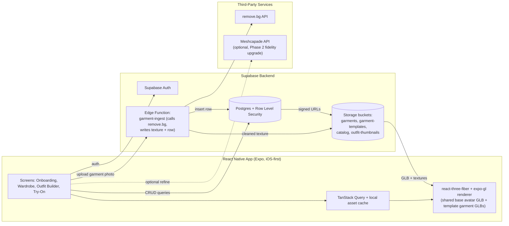

# Selv — Product & Technical Spec

Working name: **Selv**. Cross-platform (iOS/Android via React Native + Expo) Gen Z virtual wardrobe and 3D try-on app.

Last updated: 2026-07-14 · **Avatar approach updated: 2026-07-20**

---

> **Avatar approach (updated):** Selv no longer builds the avatar from a photo or body measurements. Users **design a customizable stylized character** in a character creator — skin tone, face shape, eyes, hair, brows, facial hair, body type, and accessories — stored as a `customization` model (see `AVATAR_CREATOR_PLAN.md`). It renders today as a procedural stylized character (a live 2D SVG preview plus a generic 3D try-on body shaped/tinted from the same choices), upgradeable later to a commissioned modular 3D avatar. This supersedes the photo-upload + measurement-driven body-shape pipeline described in §5a below (kept there for its licensing/tech research, flagged as superseded). Garment photos (photos of the user's own clothes) are unaffected — still core to the product.

## 1. Product Overview & Vision

Selv turns a user's real closet into a rotatable 3D wardrobe: **design a customizable stylized character** in a character creator, digitize the clothes you own (or pull them from a searchable catalog), mix them into outfits on your character, and preview items you're thinking about buying — all before Phase 2 turns it into a social styling feed. The wedge is speed and honesty: a fast, good-enough 3D preview beats a slow, "perfect" one, and the roadmap is explicit about what's simulated vs. what's a stylized approximation.

## 2. Target User & Core Jobs-To-Be-Done

**Target user:** Gen Z (16–26), fashion-engaged, phone-native, already used to TikTok/Pinterest outfit content and Depop/Vinted resale culture, and comfortable customizing an avatar/character (Bitmoji, Genshin Impact, Zepeto energy). Comfortable uploading photos of their clothes; skeptical of anything that looks like a bad AI filter.

**Core jobs-to-be-done:**
1. "Help me see what I actually own" — a visual inventory of my closet, better than a camera roll folder.
2. "Help me decide what to wear" — mix-and-match on a character I designed to look like me, not a generic model.
3. "Help me not buy the wrong thing" — try an item on my avatar before purchasing, especially for online/resale buys where returns are a hassle.
4. "Help me remember what worked" — save named outfits (e.g. "job interview," "festival day 2") to reuse instead of re-deciding from scratch.
5. (Phase 2) "Help me show off / get inspired" — share fits, browse friends' and creators' wardrobes.

## 3. MVP Scope vs. Deferred

| Capability | MVP (in) | Deferred (out) |
|---|---|---|
| Platform | iOS first (single platform), Android-ready codebase | Simultaneous Android launch, tablet/web |
| Avatar generation | Customizable stylized character via an in-app character creator (skin tone, face shape, eyes, hair, brows, facial hair, body type, accessories), stored as a `customization` model | Photo-based body-shape estimation, facial likeness, any photo-derived avatar (superseded — see the avatar-approach note in §1) |
| Garment digitization | Upload photo → background removal → auto-texture onto nearest category template | True photo→3D reconstruction (accurate cut/silhouette), pattern-level simulation |
| Catalog search | Small curated seed catalog (~150–300 items), keyword/category search | Live partner/affiliate product feeds, price/inventory sync |
| Outfit builder | Drag garments onto avatar, layer/reorder, save named outfits | AI-generated outfit suggestions, weather-aware recommendations |
| Try-before-you-buy | Try any catalog item on your own avatar | Try items on other users' avatars, size-recommendation engine |
| Cloth behavior | Skinned templates that scale/pose with the avatar skeleton | Real-time physics cloth simulation, fabric-accurate drape |
| Social | None — data model reserves the tables | Follow, share, feed, likes/comments |
| Auth | Email/password + Apple/Google sign-in | Guest mode, multi-profile per account |

## 4. Full Feature List

### Onboarding & Character Creator
- Account creation (Supabase Auth: email/password, Sign in with Apple, Google OAuth)
- Character creator: users design their avatar by picking skin tone, face shape, eyes (color + shape), eyebrows (+ color), hair (style + color), facial hair (+ color), body type, and accessories from curated option catalogs — no photo, no measurements required
- Live 2D SVG preview that re-renders instantly as options change, plus a rotate/zoom 3D preview of the try-on body
- Optional height/weight fields (reference only — not required, and no longer used to derive body shape)
- Re-openable any time from Profile → "Edit your character" (updates the stored `customization` and live preview)

### Wardrobe (Upload + Catalog Search)
- Upload garment photo (camera or library) → guided capture UI (flat-lay/mannequin framing tip, plain-background prompt)
- Background removal + auto-crop, garment category picker (top, bottom, dress, outerwear, shoes, accessory — extendable)
- Auto-texture applied to nearest template garment for that category; user confirms/retakes
- Manual metadata: name, color, brand, tags
- Catalog search: keyword + category/brand filters over the seeded catalog; "Add to wardrobe" without uploading (creates an owned reference, no image upload needed)
- Wardrobe grid/list view, edit/delete items

### Outfit Builder & Saving
- Avatar viewport (rotate, zoom, walk-around) with garment slots (top/bottom/dress/outerwear/shoes/accessory)
- Tap-to-equip from wardrobe; swap within a slot; layering order (e.g. jacket over shirt)
- Save outfit with a name; outfit list with thumbnail (rendered snapshot)
- Duplicate/edit/delete saved outfits

### Try-Before-You-Buy
- From catalog search or a garment detail view, "Try it on" renders the item on the user's own avatar without adding it to their wardrobe
- One-tap "Add to wardrobe" if they decide to keep it (marks as catalog-sourced, not owned-yet vs. owned once purchased — see data model)

### Social (Phase 2 — not built in MVP, schema reserved)
- Public/friends-only outfit sharing with a shareable link/card
- Follow other users, browse their public outfits
- Like/comment on shared outfits
- Discover feed seeded by follows + catalog trends

## 5. The 3D Pipeline, End to End

This is the technical heart of the product and the place to be most honest about tradeoffs.

> **Avatar approach (updated) — see §1.** Section 5a below documents the original photo/measurement-driven parametric-avatar research (SMPL/Anny/MakeHuman licensing, Ready Player Me sunset, etc.). It is **superseded**: Selv no longer estimates body shape from measurements or a photo. It's kept here as historical technical/licensing rationale, since some of the same infrastructure (a shared base mesh, on-device rendering, license-clean assets) is still relevant to rendering the character creator's output in 3D. The current approach: users pick skin tone, face shape, eyes, hair, brows, facial hair, body type, and accessories in a character creator, stored as a `customization` jsonb blob (see `AVATAR_CREATOR_PLAN.md`). v1 renders this as a live 2D SVG character plus a generic 3D try-on body shaped/tinted from `customization`; a commissioned modular 3D avatar (rigged base + morph targets + swappable hair meshes) is the planned Phase 2 fidelity upgrade.

### 5a. Avatar generation — superseded pipeline (historical: parametric, measurement-driven)

**Recommendation: build an in-house parametric rig derived from MakeHuman/Anny assets, not SMPL/SMPL-X directly.**

- **SMPL / SMPL-X** (Max Planck Institute) is the academic gold standard for parametric human bodies, but its default license is **non-commercial/research-only**. Commercial use requires a paid license, in practice obtained through **Meshcapade** (the company that stewards SMPL commercially; email-gated pricing, roughly enterprise-quote territory). Flag this clearly so it's never accidentally shipped under the free research license.
- **Anny** (NAVER LABS Europe, released 2025) is a free, Apache-2.0-licensed parametric human body model built on open MakeHuman-community assets, with 564 artist-defined blendshapes and a documented mapping to/from SMPL-X for research interop. Its *native* topology is Apache-2.0 and commercially usable; the SMPL-X-*compatible* topology it also ships is marked non-commercial as of v0.3. Since Selv never needs SMPL-X compatibility (we are not doing image-based mesh recovery — see below), the native Anny topology is a clean, free, commercially-safe starting point.
- **MakeHuman** itself: community asset library historically released under CC0, engine under AGPL. We don't ship the MakeHuman engine at runtime — we use its assets/derivatives (via Anny or directly) as raw material in Blender to author our own curated rig, then export a single GLB. (Verify current MakeHuman asset licensing terms before shipping; open-source license terms occasionally change.)
- **Ready Player Me**, previously the default "generate my avatar" SDK for RN apps, **sunset its consumer avatar platform on Jan 31, 2026** — it is not a viable pick today. Its suggested successor, **Avatar SDK**, and **Avaturn** (Pro plan ≈ $800/mo for 6,000 avatars) are selfie-driven, commercially licensed, and priced for post-revenue scale, not a bootstrapped 10-day MVP.

**MVP approach:** author one base mesh + skeleton (~10–15k tris, ~30–40 bones, Mixamo-compatible naming for future animation reuse) with a curated set of ~10 morph targets that actually matter for clothing fit: height (bone scale), weight/volume, bust/chest, waist, hip, shoulder width, torso length, limb length. Map the user's height/weight/tape measurements to blendshape weights with calibrated formulas anchored to public anthropometric survey data (e.g. ANSUR II). Store only the resulting **weight vector** (a small JSON blob) per user — not a unique mesh. At render time, the client loads the one shared base GLB (bundled with the app or cached from Storage) and applies the user's weights on-device. This means asset storage and CDN cost stay flat regardless of user count, and it sidesteps SMPL licensing entirely.

**Photo's role in MVP:** the user's photo is *not* used for body-shape estimation — body shape comes entirely from typed-in measurements, which is faster to build, more predictable, and avoids bias/fidelity failure modes of single-photo body estimation. Photo is optional in MVP and only used for a future facial-likeness or skin-tone-sampling refinement (Phase 2). This matches the product's own framing (parametric, not photogrammetry, not AI image try-on).

**Optional Phase 2 enhancement — photo-refined measurements:** services like **3DLook** (2-photo, 80+ measurements) and **Bodygram** (phone-scan measurements) or **Meshcapade Me API** (image + measurements → SMPL-based avatar, millimeter-level accuracy) can refine or auto-fill measurements from photos. All are paid, per-scan APIs — worth adding once there's a revenue base to justify the marginal cost and once the manual-measurement flow has validated demand.

**Status: superseded.** None of §5a's photo/measurement pipeline is used for avatar generation today — avatars are entirely user-authored via the character creator (skin, face, eyes, hair, brows, facial hair, body type, accessories). This section is retained for its body-model licensing research (SMPL/Anny/MakeHuman, Ready Player Me's shutdown), which remains relevant background for whichever 3D rendering backend the character creator's output eventually uses. See `AVATAR_CREATOR_PLAN.md` for the current data model and rendering roadmap.

### 5b. Garment creation: 2D photo → 3D garment

**Be honest: true photo→3D garment reconstruction (accurate cut, seams, drape) is a hard, unsolved-at-consumer-scale problem.** Research systems exist — e.g. Stanford/ETH's **AIpparel** (2025) generates sewing patterns from text/image prompts that are simulation-ready — but they require an offline simulation pass (like Marvelous Designer/CLO) and are not real-time, not mobile, and not production-hardened for a solo 10-day build. Full-fidelity garment sim (Marvelous Designer, CLO3D) is an offline, artist-driven pipeline used by fashion houses, not something you point a phone camera at.

**Pragmatic MVP path (recommended): template garments + auto-texture from photo, categorized by garment type.**
1. Author (or license from Sketchfab/CGTrader with commercial rights) a library of ~15–25 template garments spanning core categories (t-shirt, hoodie, button-down, dress, jeans, shorts, skirt, jacket, sneakers). Each is skinned to the **same skeleton** as the avatar.
2. User uploads a garment photo → background removed (remove.bg API) → user confirms category (manual picker in MVP; optional auto-classification later) → the cleaned, cropped photo is projected onto the matching template's UV-mapped "front panel" as a texture; back/side panels fall back to a solid color sampled from the photo or a generated mirror.
3. The result is *not* a reconstruction of the garment's real cut — it's "your photo, skinned onto the closest-shaped template." UI copy should set this expectation (e.g., "preview," not "exact replica").
4. **Ambitious path (Phase 3+):** garment segmentation + multi-view capture (front/back photos) + semi-automated UV unwrapping, or eventually an offline Marvelous Designer/CLO pipeline operated by a human 3D artist for "hero" catalog items, or production-grade neural reconstruction once it matures beyond research demos.

### 5c. Draping / fit at MVP level

**Recommendation: skinned garment meshes riding the avatar's skeleton, not real-time cloth simulation.**

Real-time cloth sim (position-based dynamics, mass-spring systems — what CLO3D/Marvelous Designer do offline, or engines like NVIDIA Flex/Unity Cloth at runtime) is not shippable on mobile React Native at interactive frame rates within a solo 10-day build, and is arguably not necessary for the "does this outfit look right" use case.

Instead: every template garment shares the avatar's armature and is skinned (weight-painted) to it, so garments automatically follow the avatar's pose/rotation via standard GLTF linear-blend skinning — no per-garment runtime physics. To handle different body sizes without true draping, author each template at a couple of base sizes (e.g. S/M/L) authored around the same blendshape ranges as the avatar, and pick the nearest size bucket at equip time; accept minor clipping at extreme body-size combinations as a known MVP limitation, called out in-app rather than hidden. This is the same category of trick used by Ready Player Me/VRoid-style "layered clothing" systems, and it is genuinely shippable in days, not weeks.

### 5d. Rendering in React Native

**Recommendation: `expo-gl` + `expo-three` + `@react-three/fiber` (native renderer) for the MVP.**

| Option | Pros | Cons |
|---|---|---|
| **expo-gl + expo-three + react-three-fiber** (recommended) | Works inside a standard Expo dev client/EAS Build without a full bare eject; huge Three.js ecosystem (GLTF loaders, morph-target/skinning support, `@react-three/drei` helpers) most engineers already know; fastest path for a solo 10-day build | Uses OpenGL ES on iOS, which Apple has deprecated (still functional, but not the modern path); ceiling on performance for heavy scenes/many simultaneous garments/shadows |
| **react-native-filament** (Margelo) | Native C++ PBR rendering via Filament (Metal on iOS, Vulkan/OpenGL on Android); noticeably better perf and visual quality; used in production apps at scale | Not compatible with Expo Go (requires a custom dev client / prebuild — not a full "eject" but does mean native config); smaller community/fewer ready-made R3F-style abstractions; more setup time than fits in a 10-day MVP |
| Viro React | Older AR-focused RN 3D framework | Maintenance has slowed; smaller community than R3F; less GLTF morph-target maturity |
| WebView + Three.js | Full desktop-grade Three.js, easy to prototype in browser first | Bridge overhead, worse perf, awkward native gesture/texture-upload integration, feels "web-in-app" |
| Unity-as-a-Library | Best-in-class rendering/physics ceiling | Massive setup overhead, huge binary size, breaks Expo's iteration loop entirely — wrong tool for a 10-day solo MVP |

Ship on `expo-gl`/R3F for MVP; plan a migration to `react-native-filament` post-MVP once the avatar+garment scene needs better performance/visual fidelity (more layered garments, PBR fabrics, shadows) than R3F comfortably delivers on mid-range Android hardware.

### 5e. Honest limitations summary

- Avatars are user-designed stylized characters (chosen from preset options, not derived from a photo or measurements) — proportion-accurate stand-ins, not photorealistic likenesses.
- Garments are photo-textured templates, not true reconstructions of cut/fit — expect visible seams between "your fabric" and "the template's silhouette" for unusual garment shapes.
- No real-time cloth physics; draping is skeleton-driven, not fabric-simulated.
- Performance on older/low-end Android devices is a real risk (see §9) and drives the strict poly/texture budgets in the tech stack.

## 6. System Architecture

Client owns all rendering and applies the user's `customization` choices to the shared base character (cheap, on-device). Supabase owns identity, relational data, and file storage behind RLS. The only server-side compute is a small Edge Function that proxies garment photos to remove.bg and writes the result back — everything else is direct client↔Supabase via the JS SDK, which keeps the backend nearly serverless and cheap to run solo.

## 7. Data Model (Supabase Postgres)

Builds on top of the existing minimal schema already scaffolded in the repo (`app/supabase/schema.sql`: `profiles`, `garments`, `outfits`, `outfit_items`) — extended with `avatars`, `garment_templates`, `catalog_items`, and the Phase-2 social tables `follows`/`shared_outfits`.

| Table | Key columns | Notes / relationships |
|---|---|---|
| `auth.users` | `id` (uuid, PK) | Managed by Supabase Auth |
| `profiles` | `id` (PK, FK→`auth.users.id`), `display_name`, `body_type` (enum), `skin_tone`, `created_at` | 1:1 with `auth.users`, auto-created via trigger on signup |
| `avatars` | `id` (PK), `user_id` (FK→`auth.users.id`), `customization` (jsonb: skinTone, faceShape, eyeColor, eyeShape, eyebrows, eyebrowColor, hairStyle, hairColor, facialHair, facialHairColor, bodyType, accessories[]), `height_cm` (nullable, optional reference only), `weight_kg` (nullable, optional reference only), `measurements` (jsonb, legacy — no longer required), `blendshape_weights` (jsonb, legacy — unused by the current character-creator renderer), `base_mesh_version` (text), `preview_thumbnail_path`, `updated_at` | 1:1 (or 1:few if multi-avatar later) with user; `customization` is now the primary appearance model, applied client-side to render the character (2D preview + 3D try-on body); `height_cm`/`weight_kg` are optional and no longer used to derive body shape — `bodyType` inside `customization` shares its enum with `profiles.body_type` |
| `garment_templates` | `id` (PK), `category` (enum), `size_bucket` (enum: S/M/L), `mesh_path`, `uv_slot_meta` (jsonb: front-panel UV rect etc.), `is_active` | System-owned, shared read-only across all users; versioned |
| `garments` | `id` (PK), `user_id` (FK), `template_id` (FK→`garment_templates.id`, nullable if catalog-sourced), `image_path`, `texture_path`, `category` (enum), `name`, `color`, `brand`, `tags` (text[]), `source` (enum: `upload`/`catalog`), `processing_status` (enum: `pending`/`processed`/`failed`), `created_at` | Existing table, extended with `template_id`, `texture_path`, `source`, `processing_status` |
| `catalog_items` | `id` (PK), `template_id` (FK→`garment_templates.id`), `name`, `brand`, `category` (enum), `color`, `texture_path`, `thumbnail_path`, `price_cents`, `external_url`, `search_tsv` (tsvector, generated) | Public-read; searched via Postgres full-text search / `pg_trgm`; MVP seeded manually (~150–300 rows) |
| `outfits` | `id` (PK), `user_id` (FK), `name`, `thumbnail_path`, `created_at`, `updated_at` | Existing table |
| `outfit_items` | `outfit_id` (FK, composite PK), `garment_id` (FK→`garments.id`, nullable), `catalog_item_id` (FK→`catalog_items.id`, nullable — for try-before-you-buy items not yet owned), `slot` (enum: top/bottom/dress/outerwear/shoes/accessory), `layer_order`, `created_at` | Existing table, extended with `catalog_item_id` and `slot` so try-on items can be added to a saved outfit without being "owned" |
| `follows` *(Phase 2)* | `follower_id` (FK), `followee_id` (FK), `created_at` | Composite PK `(follower_id, followee_id)` |
| `shared_outfits` *(Phase 2)* | `id` (PK), `outfit_id` (FK), `user_id` (FK), `visibility` (enum: public/followers), `share_slug`, `like_count`, `created_at` | Public-read when `visibility='public'` |

**RLS pattern** (matches the existing schema's convention): every user-owned table has `for all using (user_id = auth.uid()) with check (user_id = auth.uid())`. `garment_templates` and `catalog_items` get a public `for select using (true)` policy since they're shared/system data. `shared_outfits` gets a conditional select policy on `visibility = 'public' or user_id = auth.uid()`.

**Storage buckets:** `garments` (private, existing — user photo + processed texture), `garment-templates` (public-read, system-managed GLBs), `catalog` (public-read, catalog thumbnails/textures), `avatar-previews` (private, per-user rendered thumbnail snapshots), `outfit-thumbnails` (private, per-outfit rendered snapshots). The base avatar mesh itself is small enough to bundle in the app binary rather than fetched from Storage, avoiding a network round-trip on every launch.

## 8. Tech Stack Summary

| Layer | Chosen tech | Why | Alternative considered |
|---|---|---|---|
| Mobile framework | Expo (managed workflow + dev client, SDK 54+) | Fastest cross-platform iteration; EAS Build/Submit handles signing/store upload; avoids native project boilerplate | Bare React Native CLI — more control, much slower setup for a 10-day build |
| 3D rendering | `expo-gl` + `expo-three` + `@react-three/fiber` | Runs in an Expo dev client without a full bare eject; mature GLTF/skinning/morph-target support; large ecosystem/examples | `react-native-filament` — better perf/PBR via Metal/Vulkan, but no Expo Go and more native setup time |
| Avatar body model | **Character creator** (supersedes the parametric-rig approach): user-authored `customization` (skin tone, face shape, eyes, hair, brows, facial hair, body type, accessories) rendered as a procedural stylized 2D SVG + generic 3D try-on body today; upgradeable to a commissioned modular 3D avatar (rigged base + morph targets + swappable hair meshes) | No photo/measurement dependency, zero marginal per-avatar cost, full control, works fully offline on-device, and is a privacy win (no biometric-adjacent data) | Licensed selfie-to-3D SDKs (Avatar SDK/MetaPerson, Avaturn) — skipped, they're selfie-first and contradict the no-photo decision; see `AVATAR_CREATOR_PLAN.md` |
| Garment 3D | Template GLB library (15–25 garments) + photo-texture projection | Only photo→3D approach realistically shippable solo in days | Marvelous Designer/CLO offline sim, or research pipelines (AIpparel) — high fidelity but artist/ops-heavy, not solo-10-day feasible |
| Backend | Supabase (Postgres + Auth + Storage + RLS) | Integrated auth/db/storage; RLS maps cleanly to per-user wardrobe data; already scaffolded in the repo; generous free tier | Firebase — weaker relational queries/joins for outfit/catalog search; custom Node+Postgres+S3 — more ops overhead for a solo founder |
| Background removal | remove.bg API | Reliable, fast, pay-per-use, zero ML infra to operate | On-device segmentation (Apple Vision `VNGeneratePersonSegmentationRequest` / Google ML Kit Subject Segmentation) — free but more native code and variable quality; good cost-reduction path once volume grows |
| Garment classification | Manual category picker (MVP) | Zero-risk, zero-cost, fast to build; users are willing to tap one button | CLIP zero-shot / fine-tuned classifier on DeepFashion2 categories — deferred; note DeepFashion2's dataset license is non-commercial-research-only, so any classifier trained on it must stay an internal tool, not redistributed data |
| Catalog seed | Manually curated ~150–300 items (owned photography/licensed stock) | DeepFashion2 is non-commercial only; partner/affiliate feeds need biz-dev lead time neither fits in 10 days | Affiliate feed (Rakuten Advertising, CJ Affiliate, ShopStyle Collective API) — real shoppable inventory, targeted for Phase 2 |
| Data/query layer | Supabase JS client + TanStack Query | Caching, optimistic updates, works well with Supabase's REST/Realtime | Redux Toolkit Query — more boilerplate for the same result |
| Auth | Supabase Auth (email/password + Sign in with Apple + Google OAuth) | Native RLS integration via `auth.uid()`; Apple sign-in is an App Store requirement if any other social login is offered | Clerk — nicer DX but a second vendor/billing relationship to manage solo |
| CI/CD & distribution | EAS Build + EAS Submit, TestFlight | Free tier covers 15 iOS + 15 Android builds/month, enough for a 10-day MVP | Fastlane + manual Xcode/Play Console — more setup, more maintenance |

## 9. Key Technical Risks & Mitigations

| Risk | Impact | Mitigation |
|---|---|---|
| Photo→3D garment fidelity is inherently approximate | Users disappointed the garment doesn't look "exactly like mine" | Set expectations in UI copy ("preview," not "exact replica"); invest template quality/variety over reconstruction accuracy; roadmap the ambitious path for later, don't over-promise now |
| Avatar realism / character feeling "not like me" | Low emotional attachment, low retention | Character creator gives users direct authorship (skin, face, eyes, hair, brows, facial hair, body type, accessories) rather than an algorithmically-estimated likeness; stylized, art-directed rendering always looks intentional; no photo/measurement estimation to get "wrong" |
| On-device performance (older/low-end Android, GPU/texture memory) | Frame drops, crashes, App Store rejection risk | Strict budgets: avatar <30k tris, each garment <5k tris, total scene <60k tris; 2K max texture size, Draco/meshopt (`gltfpack`) compression; texture atlasing; cap simultaneously-rendered garments; test weekly on a real low/mid-range Android reference device, not just simulator |
| Character customization coverage/diversity | Users can't find an option that looks like them, or one body type/skin tone renders with lower fidelity than others | Curate broad option catalogs (10 skin tones, 12 hair colors, 8 eye colors, multiple body types) and QA equal rendering fidelity across all of them, not just a default; this risk replaces the old "measurement→blendshape mapping accuracy" risk now that avatars are no longer measurement-derived |
| Garment-photo segmentation edge cases (patterned/similar-color backgrounds) | Bad cutouts, ugly textures | Guided capture UI (plain background prompt, flat-lay/mannequin framing tip); remove.bg fallback plus a manual crop/retry step |
| Storage/bandwidth cost scaling with users | Runaway Supabase bill | Share template/base-mesh assets across all users (only per-user texture + small weight-vector JSON is unique); compress textures (WebP/KTX2); short-TTL signed URLs with client-side caching |
| Licensing landmines (SMPL, DeepFashion2, purchased 3D assets, stock photos) | Legal exposure, forced rework | Use Apache-2.0/CC0-derived body rig (not raw SMPL); never redistribute DeepFashion2 data or train on it for anything shipped externally; verify commercial-use terms on every purchased Sketchfab/CGTrader asset before use |
| App Store review risk around body-image/photo features | Rejection or forced feature removal | No nudity/deepfake-adjacent capability (explicitly no face-swap or photoreal body scan from photos); clear ToS and minors-safety given a Gen Z audience; age-appropriate framing |
| Solo-founder scope creep | Missed 10-day target | Ruthless MVP cut list (see §3 and the companion `BUILD_ROADMAP_10DAY.md`); catalog search and social explicitly deferred/stubbed |

## 10. Cost & Third-Party API Estimate (MVP, ~first 100–500 users)

| Item | Estimated cost | Notes |
|---|---|---|
| Supabase | $0 (Free tier) → $25/mo (Pro) once past free-tier storage/egress limits | Pro tier: 100GB storage, 200GB egress included |
| remove.bg API | ~$0.20/image pay-as-you-go, or $9/40 credits–$39/200 credits subscription | Budget ~$20–40/mo at low MVP volume (a few hundred garment uploads) |
| EAS Build/Submit | $0 (Free tier: 15 iOS + 15 Android builds/mo) | Sufficient for a 10-day build + iteration; upgrade to a paid tier only if build volume spikes |
| Apple Developer Program | $99/year | Required for TestFlight distribution |
| Google Play Console | $25 one-time | Only needed once Android launch is scheduled (can defer past the 10-day iOS-first MVP) |
| Domain + misc (email, analytics) | ~$10–20/mo | Domain, transactional email (Supabase built-in or Resend), basic analytics (PostHog free tier) |
| Meshcapade API (optional Phase 2) | Quote-based (enterprise pricing) | Not needed for MVP; budget once revenue justifies the fidelity upgrade |
| **Estimated MVP monthly run rate** | **~$50–90/mo** (excluding one-time Apple/Google fees) | Scales primarily with garment-photo volume (remove.bg) and storage/egress |

## 11. Post-MVP Roadmap (Phases 2–3)

**Phase 2 (weeks 3–8 post-launch):**
- Android launch (same codebase, platform QA pass)
- Social layer: follows, public/friends outfit sharing, share cards, basic feed
- Modular 3D avatar upgrade: commission/source a stylized rigged base mesh + morph targets + swappable hair-mesh library so the character creator's `customization` output renders as a full 3D character (not just the 2D SVG + generic try-on body) — see `AVATAR_CREATOR_PLAN.md`
- On-device background removal to cut remove.bg cost at scale (Apple Vision / ML Kit)
- Auto garment classification (CLIP zero-shot or a small fine-tuned model) to remove the manual category tap
- Affiliate/partner catalog feed (Rakuten Advertising, CJ Affiliate, or ShopStyle Collective) replacing the manually seeded catalog
- Multi-photo garment capture (front + back) for better texture coverage

**Phase 3 (months 3–6+):**
- Migrate rendering to `react-native-filament` for better fidelity/performance as scene complexity grows
- Self-owned modular avatar, fully realized: authored facial + body morph targets and a complete hair-mesh library so the character creator maps 1:1 to a bespoke 3D character (no vendor selfie-SDK — see `AVATAR_CREATOR_PLAN.md`'s option comparison)
- Ambitious garment pipeline: offline Marvelous Designer/CLO artist pipeline for "hero" catalog items; evaluate production-grade neural garment reconstruction as the research space matures
- Size-recommendation engine using catalog size charts + the character creator's body-type selection
- Discover feed, creator/brand accounts, monetization (affiliate commerce, sponsored catalog placements)
